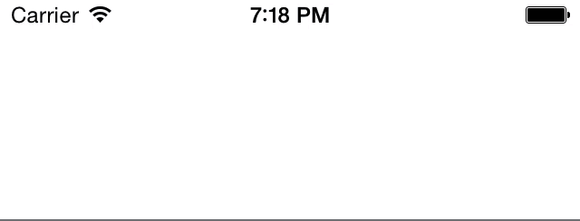

# TOMSMorphingLabel
Configurable morphing transitions between text values of a label.
Triggering the animation is as easy as setting the labels `text` property.

## Demo



## Installation with CocoaPods

TOMSMorphingLabel is available through [CocoaPods](http://cocoapods.org). To install
it, simply add the following line to your Podfile:

#### Podfile

```ruby
platform :ios, '7.0'
pod "TOMSMorphingLabel", "~> 0.5"
```

## Usage

Instantiate TOMSMorphingLabel as you would do with an UILabel results in a fully working thus morphing label.

```objective-c
TOMSMorphingLabel *label = [[TOMSMorphingLabel alloc] initWithFrame:CGRectMake(0, 42, self.view.frame.size.width, 42)];
[self.view addSubview:label];
```

Setting - and particularly changing - the labels text property will automatically morph the labels previous text to the new value.

```objective-c
label.text = @"Swift";
```

Setting the labels text property using `setText:withCompletionBlock` will morph the labels as well as triggering the completion block when the animation is finished.

```objective-c
[label setText:@"Swift" withCompletionBlock:^{
  NSLog(@"label.text is now 'Swift'");
}];
```

Note that the label will execute only one morph transition at a time. If the text value of the label changes during a transition - even if it changes multiple times - the label will invoke a transition to the youngest text value that was set.

## Customization

TOMSMorphingLabel provides the possibility to configure the morphing transitions look and feel.
The configureable properties are defined as follows:

<table>
  <caption>configureable properties</caption>
  <tr>
    <td><tt>animationDuration: CGFloat</tt></td>
    <td>Time that elapses between the setting of a new text value and the end of the morphing transition. Default: 0.37</td>
  </tr>
  <tr>
    <td><tt>characterAnimationOffset: CGFloat</tt></td>
    <td>Spatial propagation speed of the character shrink and alpha effect. Default: 0.25</td>
  </tr>
  <tr>
    <td><tt>characterShrinkFactor: CGFloat</tt></td>
    <td>Factor that the scale of a completely disappeared character is divided by. Default: 4</td>
  </tr>
  <tr>
    <td><tt>morphingEnabled: BOOL</tt></td>
    <td>Defines whether the morphing transition between text values is enabled. Default: YES</td>
  </tr>
</table>

## Changelog

#### 0.5.1
* made custom configureable properties accessible by Interface Builder

#### 0.5.0
* broke a strong reference cycle between `CADisplayLink` and `TOMSMorphingLabel`
* added invokation of the completion block when setting text without animations
* respect the global `[UIView areAnimationsEnabled]` state

#### 0.2.5
* fixed a textColor glitch
* introduced `setText:withCompletionBlock:`

#### 0.2.3
* fixed a bug that caused a crash when setting text to nil

#### 0.2.2
* added property to disable morphing

#### 0.2.1
* added support for iOS6

#### 0.2.0
* added unicode support

#### 0.1.0
* initial version

## Contribution & Contributors

I'd love to see your ideas for improving this library!
The best way to contribute is by submitting a pull request or a [new Github issue](https://github.com/TomKnig/TOMSMorphingLabel/issues/new). :octocat:

* @andrebraga added support for iOS6 in version 0.2.1
* @stepanhruda added property to disable morphing in version 0.2.2
* @itouch2 fixed a bug that caused a crash when setting text to nil in version 0.2.3
* @waynehartman fixed text color-change glitch in version 0.2.5  
* @cyril94440 added `setText:withCompletionBlock:` in version 0.2.5
* @wanderwaltz broke a strong reference cycle between `CADisplayLink` and `TOMSMorphingLabel` in version 0.5.0
* @wanderwaltz added invokation of the completion block when setting text without animations in version 0.5.0
* @wanderwaltz made `TOMSMorphingLabel` respect the global `[UIView areAnimationsEnabled]` state in version 0.5.0
* @fcanas made custom configureable properties accessible by Interface Builder

## Author

[Tom König](http://github.com/TomKnig) [@TomKnig](https://twitter.com/TomKnig)

## License

TOMSMorphingLabel is available under the MIT license. See the LICENSE file for more info.
